# Installation de Git sous debian

## 1. Installation de Git [^1]

1. Se connecter en super-utilisateur

2. Saisir la commande `apt install git-all` 

    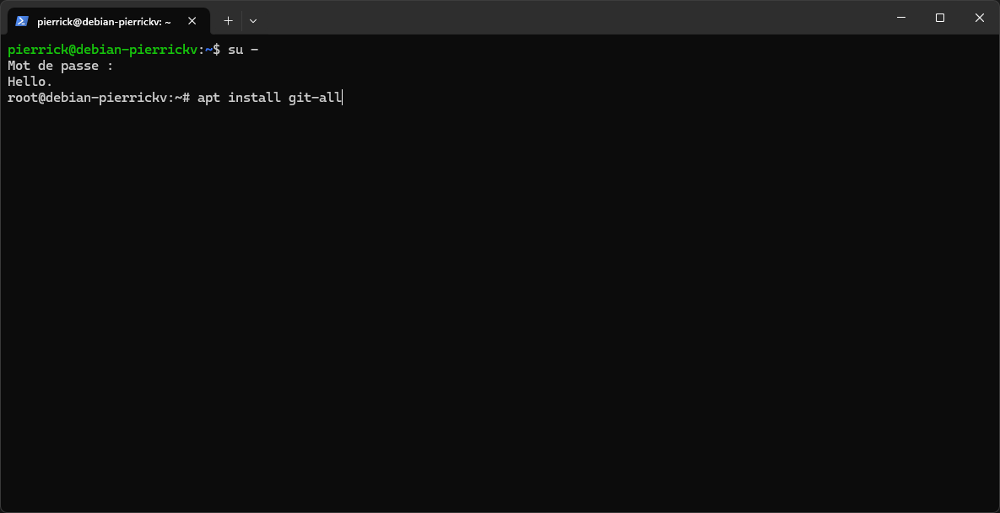

3. Saisir `o` pour confirmer l'installation

    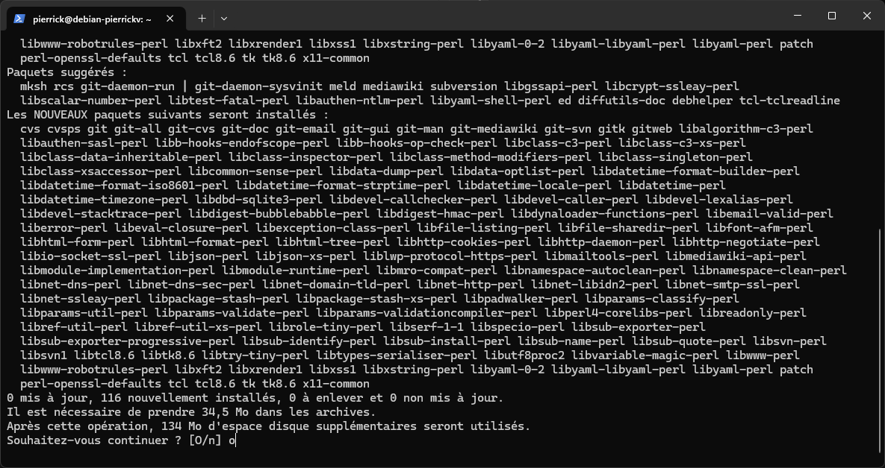

4. Git est maintenant installé! Nous pouvons vérifier la version en saisissant `git --version`

    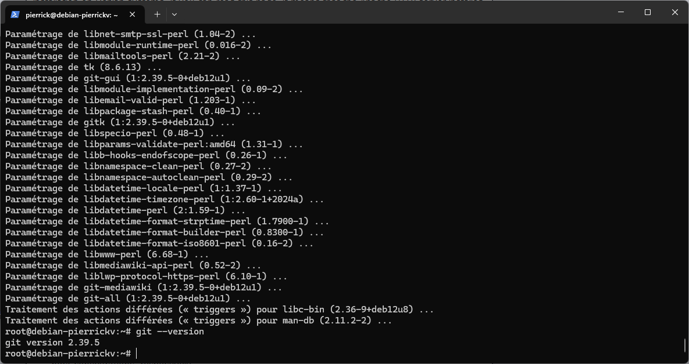

5. Nous pouvons également nous déconnecter du compte root avec "Ctrl + D"

## 2. Configuration de git [^2]

1. Configurer le nom d'utilisateur en saisissant `git config --global user.name "<votre_nom>"`

    

2. Configurer l'email en saisissant `git config --global user.email <votre_email>`

    

3. Vérifier la configuration existante avec `git config --list`
    
    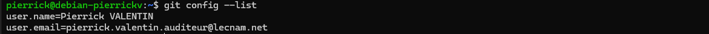

    Nous voyons le nom et l'email saisis précedemment.

4. Optionnel: Définir le nom de branche par défaut à main avec `git config --global init.defaultBranch main`

5. Les autres options de configuration sont disponibles en saisissant `git config --help`

## 3. Connecter un compte github

1. Générer un Token sur Github

    _Si vous ne voulez pas créer de token, l'authentification via un navigateur web est aussi possible_
    
    - Se connecter à github

    - Cliquer sur l'icone de profil en haut à droite

        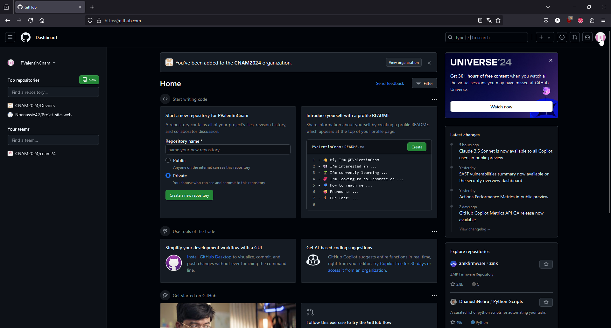

    - Aller dans "Settings"

        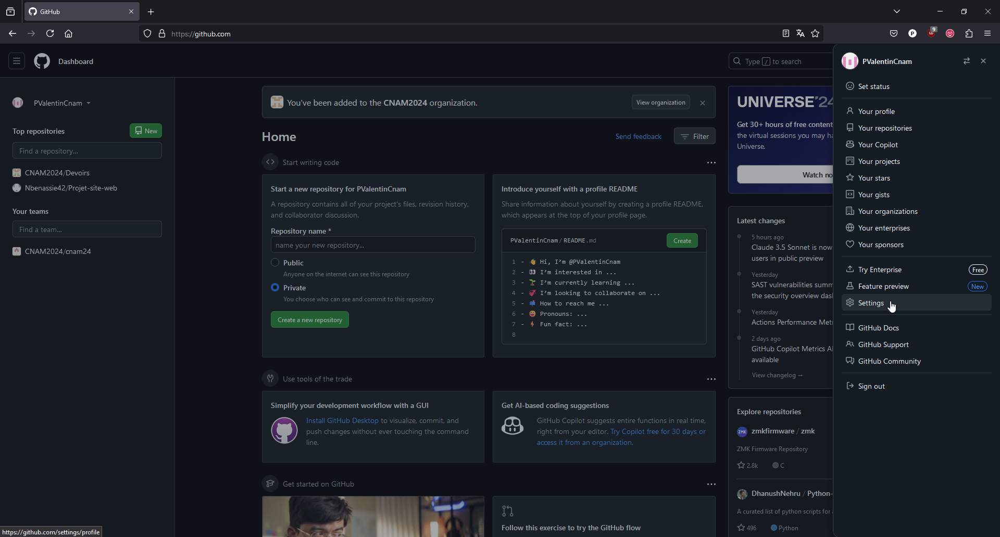

    - Aller dans "Developer settings"

        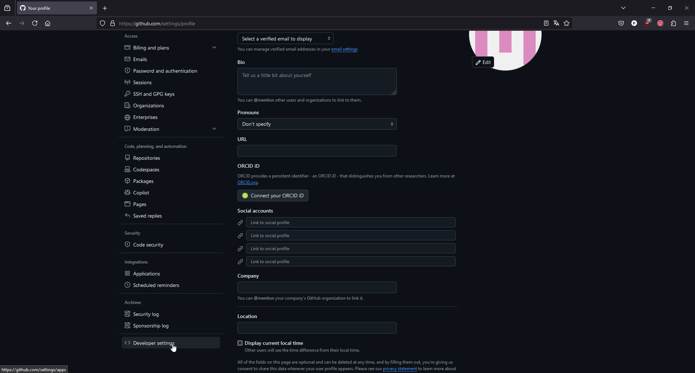

    - Cliquer sur "Personal access tokens"

        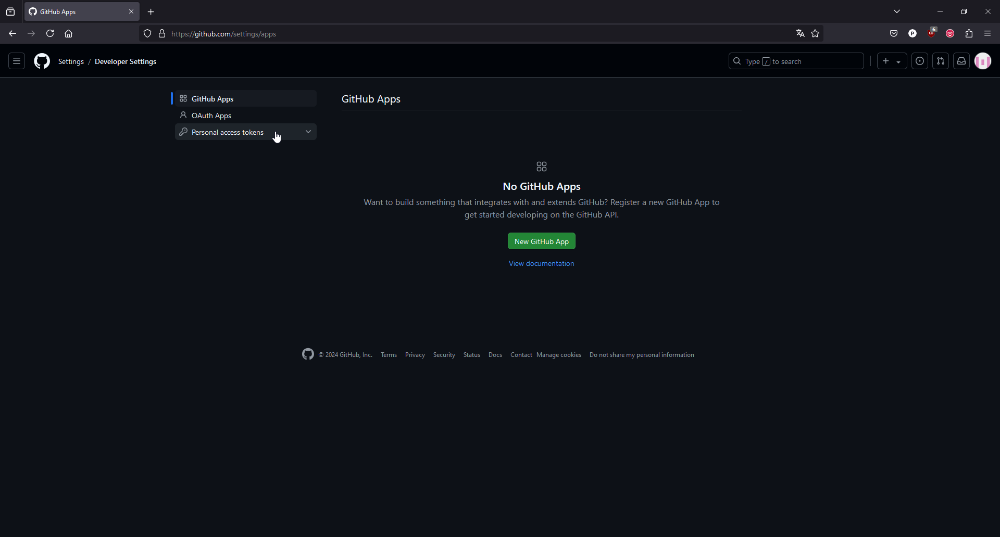

    - Puis sur "Tokens (classic)"

        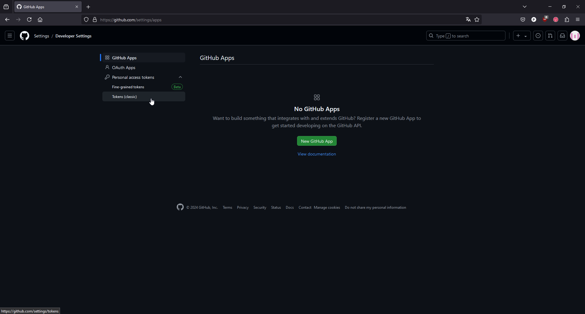

    - Cliquer sur "Generate Token"

        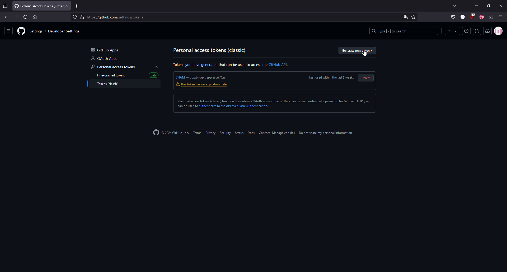

    - Puis sur "Generate new token (classic)"

        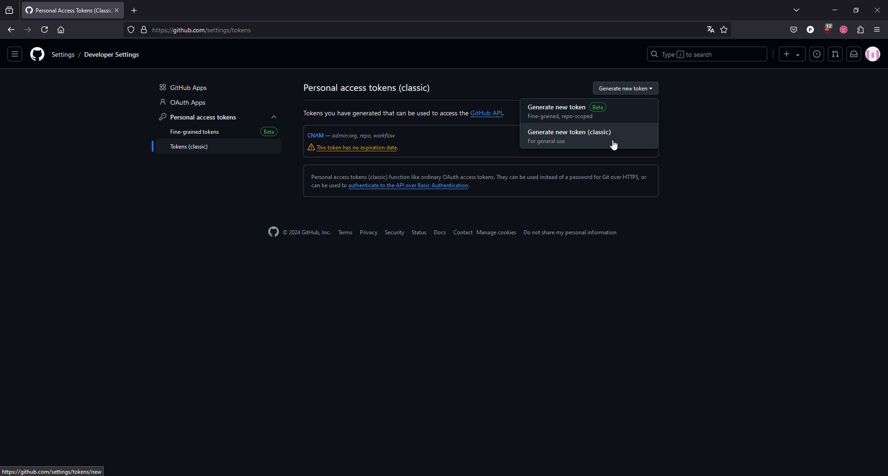

    - Entrer un nom pour le token et sélectionner une durée d'expiration

        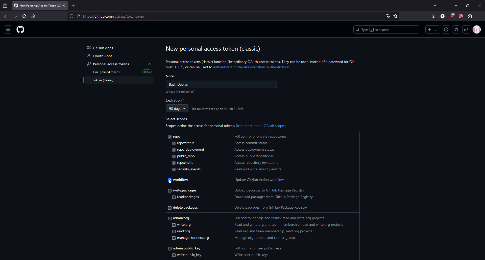

    - Sélectionner au minimum les autorisations suivantes: repo, workflow, read:org

        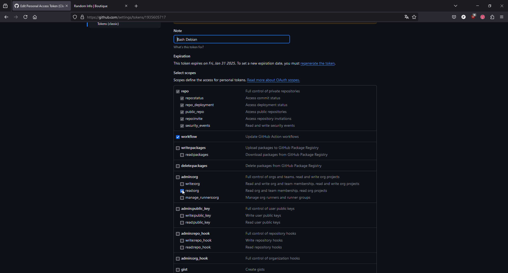

    - Cliquer sur "Generate Token"

        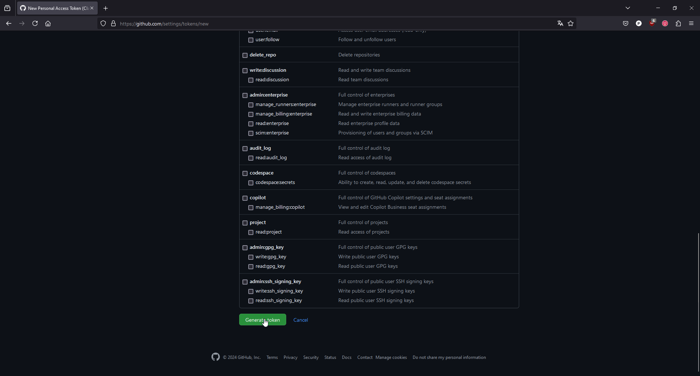

    - Copier le token généré

        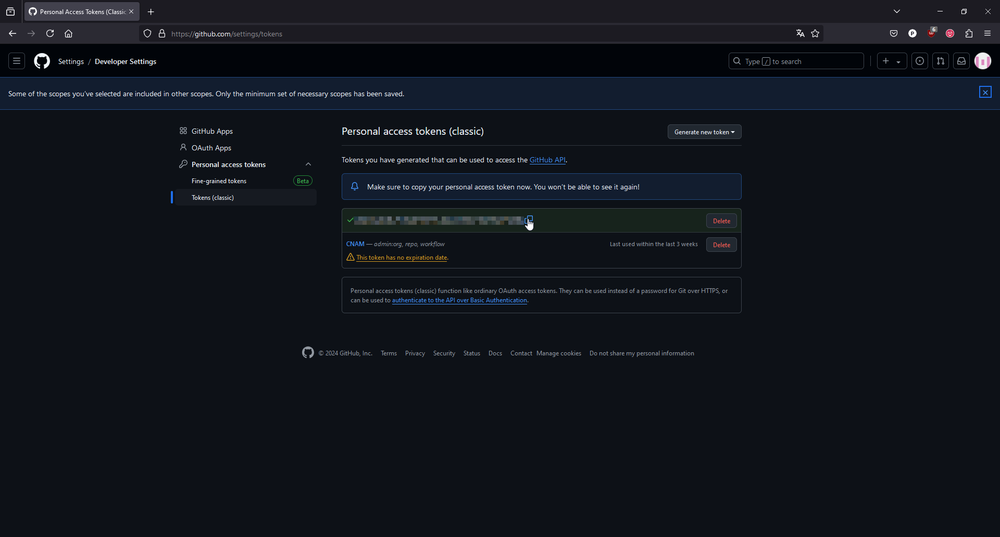

2. Installer Github CLI `apt install gh`

3. Saisir `gh auth login`

    - Sélectionner "GitHub.com"

    - Sélectionner "HTTPS"

    - Entrer `y` pour confirmer

    - Sélectionner "Paste an authentication token"

    - Coller le token

    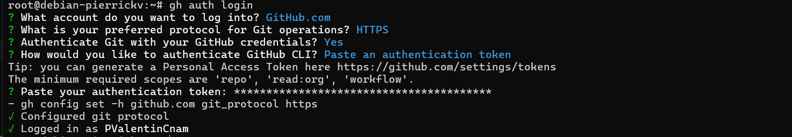